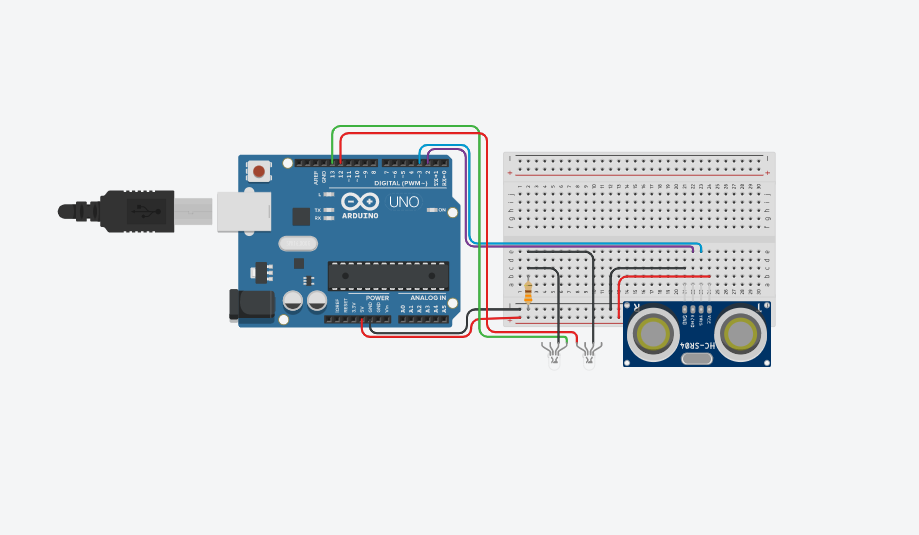
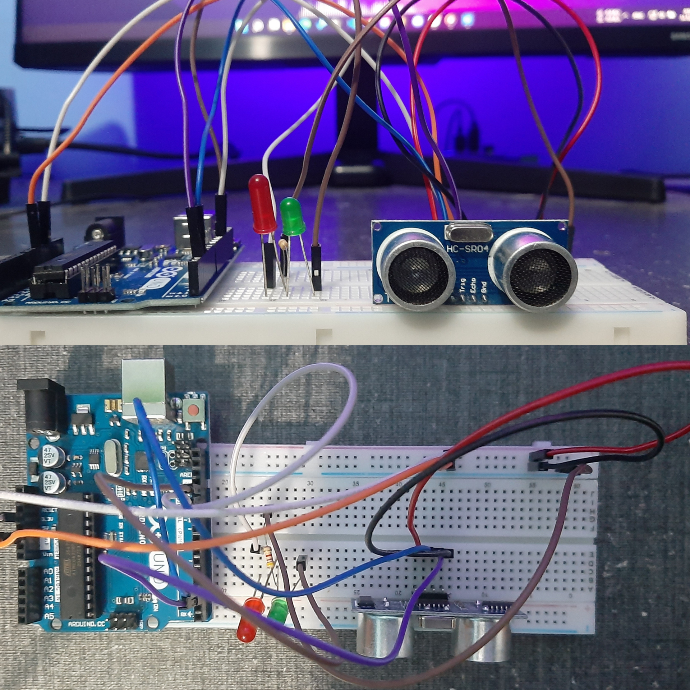

#### Simple Project With the Ultrasonic Sensor (HC-SR04)

##### Components list:
- Arduino Uno

- Ultrasonic Sensor (HC-SR04)

- Mini-BreadBoard

- 1 kohm Resistor

- Jumpers.

- Green and red LEDs

  __Circuit design:__

__Code__

~~~c
#define trigPin 3
#define echoPin 2
#define led 13
#define led_2 12

void setup(){
  Serial.begin (9600);
  pinMode(trigPin, OUTPUT);
  pinMode(echoPin, INPUT);
  pinMode(led, OUTPUT);
  pinMode(led_2, OUTPUT);
}

void loop(){ 
  long duration, distance;
  digitalWrite(trigPin, LOW);
  delayMicroseconds(2);
  digitalWrite(trigPin, HIGH);
  delayMicroseconds(10);
  digitalWrite(trigPin, LOW);
  duration = pulseIn(echoPin, HIGH);
  distance = (duration/2) / 29.1;

  if (distance < 20){
    digitalWrite(led,HIGH);
    digitalWrite(led_2,LOW);
    }
  else {
    digitalWrite(led,LOW);
    digitalWrite(led_2,HIGH);
    }
  Serial.print(distance);
  Serial.println(" cm");
  delay(500);
}
~~~
